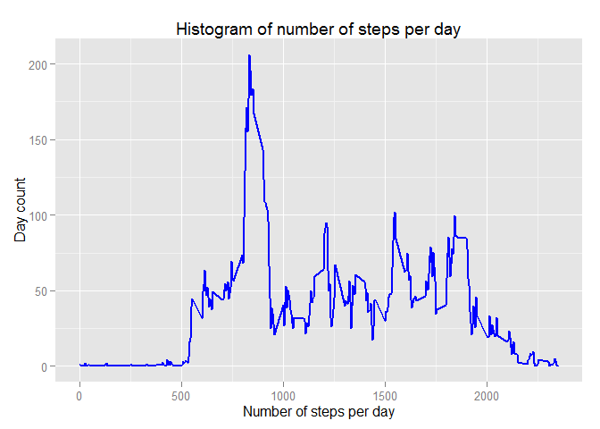
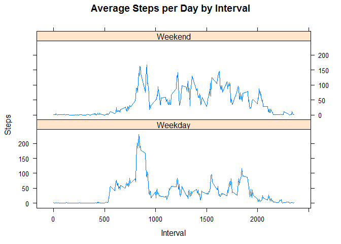

# Reproducible Research: Peer Assessment 1
Werner Straube  
Saturday, January 17, 2015  


## Loading and preprocessing the data

```r
setwd('C:/Users/straube/Documents/Coursera/Course 5 - Reproducible Research/Week 2/Peer_Assessment_1/repdata_data_activity')
activity <- read.csv("activity.csv")
```


## What is mean total number of steps taken per day?

Summarize the data by day

```r
daily_activity <-
    aggregate(formula = steps~date, data = activity,
              FUN = sum, na.rm=TRUE)
```

#### 1.) Make a histogram ofthe total number of steps taken each day

```r
library(ggplot2)
ggplot(daily_activity, aes(x=steps)) +
    geom_histogram(binwidth=3000, fill = 'red', color = 'black') +
    ggtitle('Histogram of number of steps per day')+
    xlab("Number of steps per day") +
    ylab("Day count")
```

 


#### 2.) Calculate and report the **mean** and the **median** total number of steps taken per day

Calculate summary statistics

```r
mean_steps <- round(mean(daily_activity$steps), 2)  # Mean
median_steps <- quantile(x = daily_activity$steps, probs = 0.5)  # Median, 50%Q
```
The mean total number of steps taken per day is **10766** and the median is **10765**


## What is the average daily activity pattern?
#### 1.) Summarize the data by day (time series plot of the 5-minute interval)


```r
average_daily_activity <-
    aggregate(formula = steps~interval, data = activity,
              FUN = mean, na.rm=TRUE)

ggplot(average_daily_activity, aes(x=interval, y=steps)) +
    geom_line(linetype = 'solid', size = 1, color = 'blue') +
    ggtitle('Histogram of number of steps per day')+
    xlab("Number of steps per day") +
    ylab("Day count")
```

 

## Imputing missing values

#### 1.) Calculate the total number of incomplete cases

```r
incomplete_cases <- sum(!complete.cases(activity))
```

The total number of missing values in the dataset is: **2304**


#### 2.) Device a strategy for filling in all of the missing values in the dataset

Here, we will use the mean for that 5-minute interval to fill each NA value in the steps column


#### 3.) Create a new dataset (with the missing data filled in)


```r
imputed_Data <- activity 

for (i in 1:nrow(imputed_Data)) {
    if (is.na(imputed_Data$steps[i])) {
        imputed_Data$steps[i] <- average_daily_activity[which(imputed_Data$interval[i] == average_daily_activity$interval), ]$steps
    }
}
```

Proof that all missing values have been filled in:

```r
complete_cases <- sum(!complete.cases(imputed_Data))
```
The number of missing values in the imputed datasset is **0**


#### 4.) Make a histogram of the total number of steps taken each day and Calculate and report the mean and median total number of steps taken per day.


```r
daily_activity_imputed <-
    aggregate(formula = steps~date, data = imputed_Data,
              FUN = sum, na.rm=TRUE)

ggplot(daily_activity_imputed, aes(x=steps)) +
    geom_histogram(binwidth=3000, fill = 'green', color = 'black') +
    ggtitle('Histogram of number of steps per day - imputed data')+
    xlab("Number of steps per day") +
    ylab("Day count")
```

 


Calculate summary statistics


```r
mean_steps_imputed <- round(mean(daily_activity_imputed$steps), 2)
median_steps_imputed <- quantile(x = daily_activity_imputed$steps, probs = 0.5)
```
The mean total number of steps taken per day is **10766** and the median is **10766**


## Are there differences in activity patterns between weekdays and weekends?


#### 1.) Create a new factor variable in the dataset with two levels - "weekday" and "weekend"


```r
weekdays <- c("Monday", "Tuesday", "Wednesday", "Thursday", 
              "Friday")
imputed_Data$dow = as.factor(ifelse(is.element(weekdays(as.Date(imputed_Data$date)),weekdays), "Weekday", "Weekend"))

steps_by_interval_imputed <- aggregate(steps ~ interval + dow, imputed_Data, mean)
```


#### 2.) Make a panel plot containing a time series plot (i.e. type = "l") of the 5-minute interval (x-axis) and the average number of steps taken, averaged across all weekday days or weekend days (y-axis).


```r
library(lattice)

xyplot(steps_by_interval_imputed$steps ~ steps_by_interval_imputed$interval|steps_by_interval_imputed$dow, main="Average Steps per Day by Interval",xlab="Interval", ylab="Steps",layout=c(1,2), type="l")
```

 

